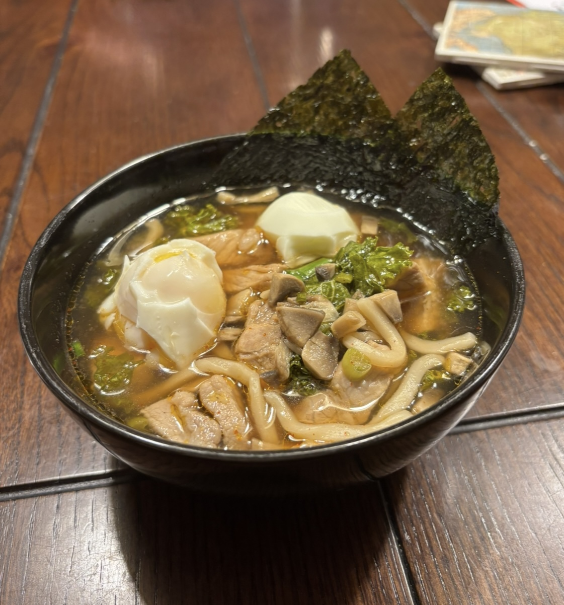

<html>
<body>
  <h1><i>Charlie G</i></h1>
  
Hi! I'm Charlie and this is a page for my SE Seminar class! You can go to RIT's SE website <a href="https://www.rit.edu/computing/department-software-engineering">by clicking here!</a>

  
Some things I'd like to learn in this course are:

  <ul>
    <li>Add more</li>
  </ul>
  
Some fun facts about me are that I've lived in 4 different states, MI, NC, RI, and now NY! I came to RIT from Rhode Island, and specifically, East Greenwich High School. I love art and animation, and spend a lot of time drawing characters from my favorite games / media. I love making art of Witch Hat Atelier, Hollow Knight / Silksong, Deltarune, In Stars and Time, and several of my own characters too! Apart from art, I also play a lot of music. I've been playing piano since I was 4, and love figuring out songs by ear. I've also been playing the Horn in F for 8 years now, and am currently in the RIT Philharmonic Orchestra, Game Symphony Orchestra, and the pit for Sunday in the Park with George. Another of my other hobbies is cooking, which I'm pretty sad I can't do as much of here. One of my favorite dishes to make back at home is stir fry, especially since it's pretty quick to make and I can put a lot of different things in it! My personal favorite recipe is spicy marinated chicken with wheat noodles and diced red peppers, onions, carrots, broccoli, and mushrooms (and maybe a side of egg or nori!). 

  
</body>
</html>
